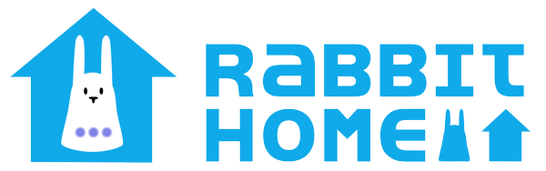

Rabbit Home is a custom home automation framework built around [nabaztag](https://en.wikipedia.org/wiki/Nabaztag) rabbits retrofitted with a [tag:tag:tag](https://www.tagtagtag.fr/) board running [pynab](https://github.com/nabaztag2018/pynab).

This project is mainly designed to meet my own needs, so it only implements features and protocols that I use. However, it contains many modules that could be repurposed for other projects involving nabaztags and/or home automation. Some example projects are provided for inspiration.

## Installing

See the [setup](setup) folder for instructions.

## Example Projects

Some projects making use of the Rabbit Home framework:

* [Rabbit RFID](https://github.com/ORelio/Rabbit-RFID): Improved RFID scanner for [tag:tag:tag](https://www.tagtagtag.fr/)'s [new NFC reader](https://www.journaldulapin.com/2022/06/30/nabaztag-nfc/)
* [Yokis-EnOcean](https://github.com/ORelio/Yokis-EnOcean): Drive Yokis shutters using batteryless EnOcean wall switches

## For developers

Here is a quick list of each module's purpose:

| Module                                             | Config file                                                 | Purpose
|----------------------------------------------------|-------------------------------------------------------------|---------
| [`actions.py`](rabbit-home/actions.py)             | None                                                        | Allows configuring actions to launch from other modules such as switches and rfid.
| [`daycycle.py`](rabbit-home/daycycle.py)           | [`daycycle.ini`](rabbit-home/config/daycycle.ini)           | Calculate sunrise/sunset/etc times based on GPS coordinates using [skyfield](https://github.com/skyfielders/python-skyfield), providing a callback mechanism when these events occur.
| [`enocean.py`](rabbit-home/enocean.py)             | [`enocean.ini`](rabbit-home/config/enocean.ini)             | Watch for events produced by batteryless [Enocean](https://en.wikipedia.org/wiki/EnOcean) sensors using a dedicated [usb dongle](https://www.enocean.com/en/product/usb-300/): switches, handheld remote control, temperature sensors... providing a callback mechanism.
| [`events.py`](rabbit-home/events.py)               | None                                                        | Simple event subscription/logging mechanism for use by other modules.
| [`httpserver.py`](rabbit-home/httpserver.py)       | [`httpserver.ini`](rabbit-home/config/httpserver.ini)       | Basic HTTP server for module APIs: nabstate, scenarios, pcstate, soundplayer...
| [`infrared.py`](rabbit-home/infrared.py)           | [`infrared.ini`](rabbit-home/config/infrared.ini)           | Wrapper around [IR-Gateway](https://github.com/ORelio/IR-Gateway) for controlling infrared-based devices.
| [`logs.py`](rabbit-home/logs.py)                   | [`logs.ini`](rabbit-home/config/logs.ini)                   | Simple python logger implementation for generating log file and console output for use by other modules.
| [`nabd.py`](rabbit-home/nabd.py)                   | See rabbits.ini                                             | Wrapper around the [Nabd](https://github.com/nabaztag2018/pynab/blob/master/PROTOCOL.md) service for interacting with [pynab](https://github.com/nabaztag2018/pynab).
| [`nabstate.py`](rabbit-home/nabstate.py)           | See rabbits.ini                                             | Monitor and/or change rabbit asleep/awake state.
| [`nabweb.py`](rabbit-home/nabweb.py)               | See rabbits.ini                                             | Wapper around the [pynab](https://github.com/nabaztag2018/pynab) Web-UI for changing settings and launching weather, air quality and taichi animations.
| [`notifications.py`](rabbit-home/notifications.py) | [`notifications.ini`](rabbit-home/config/notifications.ini) | Send push notifications on a smartphone using the [Ntfy](https://ntfy.sh/) app.
| [`pcremote.py`](rabbit-home/pcremote.py)           | [`pcremote.ini`](rabbit-home/config/pcremote.ini)           | Wrapper around [Network Remote](https://github.com/ORelio/Network-Remote) client for sending commands to a Windows PC.
| [`pcstate.py`](rabbit-home/pcstate.py)             | [`pcstate.ini`](rabbit-home/config/pcstate.ini)             | Monitor startup/shutdown of Windows PCs running [System State Webhook](https://github.com/ORelio/System-State-Webhook/) and run actions set in configuration.
| [`plugs433.py`](rabbit-home/plugs433.py)           | [`plugs433.ini`](rabbit-home/config/plugs433.ini)           | Send ON/OFF commands to 433MHz sockets using a FS1000A module and GPIO (Raspberry Pi).
| [`rabbit-home.py`](rabbit-home/rabbit-home.py)     | None                                                        | Main entry point for the program. Initialize all modules.
| [`rabbits.py`](rabbit-home/rabbits.py)             | [`rabbits.ini`](rabbit-home/config/rabbits.ini)             | Simple name <=> IP mappings for manipulating rabbits by name in other modules.
| [`rfid.py`](rabbit-home/rfid.py)                   | [`rfid.ini`](rabbit-home/config/rfid.ini)                   | Monitor RFID (NFC) events using nabd.py, and launch actions set in configuration.
| [`scenarios.py`](rabbit-home/scenarios.py)         | See scenarios below                                         | Load and initialize scenarios, launch scenarios based on event subscription.
| [`shutters.py`](rabbit-home/shutters.py)           | [`shutters.ini`](rabbit-home/config/shutters.ini)           | Wrapper around [Yokis-Hack](https://github.com/nmaupu/yokis-hack) to control shutters, with fine tracking to calculate (and move to) intermediate height.
| [`shutters_auto.py`](rabbit-home/shutters_auto.py) | [`shutters_auto.ini`](rabbit-home/config/shutters_auto.ini) | Automatically adjust shutters depending on day/night cycle and outdoor temperature.
| [`soundplayer.py`](rabbit-home/soundplayer.py)     | None                                                        | API wrapper for playing audio files on rabbits using nabd.py, served over HTTP.
| [`switches.py`](rabbit-home/switches.py)           | [`switches.ini`](rabbit-home/config/switches.ini)           | Map switch/remote button events from enocean.py to actions set in configuration.
| [`temperature.py`](rabbit-home/switches.py)        | [`temperature.ini`](rabbit-home/config/temperature.ini)     | Monitor temperature sensors from enocean.py and generate Hot/Cold temperature events for use by scenarios.
| [`weather.py`](rabbit-home/weather.py)             | See daycycle.ini                                            | Retrieve weather forecast from [meteofrance-api](https://github.com/hacf-fr/meteofrance-api) for the location set in daycycle.ini and make it available to other modules.
| [`windows.py`](rabbit-home/windows.py)             | [`windows.ini`](rabbit-home/config/windows.ini)             | Monitor window/door open/close sensors from enocean.py and generate open/close events for other modules. Manages mappings between shutters, windows and rabbits.

### Scenarios

Each python script in the [scenarios](rabbit-home/scenarios) folder is loaded automatically by [scenarios.py](rabbit-home/scenarios.py).

| Scenario                                                               | Purpose
|------------------------------------------------------------------------|---------
| [`example.py`](rabbit-home/scenarios/example.py)                       | General example of writing a scenario for use with scenarios.py
| [`example_door_sound.py`](rabbit-home/scenarios/example_door_sound.py) | Example of using soundplayer.py when an event occurs
| [`example_ears.py`](rabbit-home/scenarios/example_ears.py)             | Example of using the [Nabd](https://github.com/nabaztag2018/pynab/blob/master/PROTOCOL.md) protocol to interact with a rabbit
| [`away.py`](rabbit-home/scenarios/away.py)                             | Switch automation framework to "away mode"
| [`sleep.py`](rabbit-home/scenarios/sleep.py)                           | Switch automation framework to "sleep mode"
| [`auto_shutters.py`](rabbit-home/scenarios/auto_shutters.py)           | Companion scenario for passing events to shutters_auto.py
| [`thermostat.py`](rabbit-home/scenarios/thermostat.py)                 | Switch a heater using plugs433.py depending on temperature reported by temperature.py
| [`test_shutter.py`](rabbit-home/scenarios/test_shutter.py)             | Helper scenario for configuring precise shutter timings in shutters.ini. Callable with HTTP API offered by scenarios.py.

## License

Rabbit Home is provided under [CDDL-1.0](http://opensource.org/licenses/CDDL-1.0) ([Why?](http://qstuff.blogspot.fr/2007/04/why-cddl.html)).

Basically, you can use it or its source for any project, free or commercial, but if you improve it or fix issues,
the license requires you to contribute back by submitting a pull request with your improved version of the code.
Also, credit must be given to the original project, and license notices may not be removed from the code.
